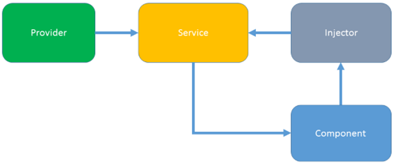

# Session 3 - Dependency Injection, Http Module and RxJs
Slides for the session can be found at [kevinhennessy.github.io/angular2/Session3](http://kevinhennessy.github.io/angular2/Session3)

In this session we will be working with a series of checkpoints for Chapter 5 of the book.The starting repository for the book chapter Checkpoint 5.1 which is located at [github.com/chandermani/angular2byexample/tree/checkpoint5.1](https://github.com/chandermani/angular2byexample/tree/checkpoint5.1). 

## Pre-reqs
This session assumes you have read chapter 5 of the book.

## Getting set up with Personal Trainer

### Project Setup
Make sure you have node and git installed.  In your favorite local folder: clone the source repository, install live-server, install gulp, install packages, checkout the starting branch, and run the app:

```
$ git clone https://github.com/chandermani/angular2byexample.git

$ npm install -g gulp

$ cd angular2byexample/trainer

$ npm install

$ git checkout checkpoint5.1

$ gulp play
```

Now open the application folder in your favorite javascript editor (VS Code, Sublime, Atom, WebStorm, etc).

> **Tip: It is strongly encouraged for you to use git to pull the application code to your local workstation.**  
This will make it much easier to track your changes, move between checkpoints, and restart if necessary.  However, if you don't have git installed you can pull down the code base at any checkpoint as a zip file: [https://github.com/chandermani/angular2byexample/archive/checkpoint5.1.zip](https://github.com/chandermani/angular2byexample/archive/checkpoint5.1.zip) &leftarrow; **Substitute any checkpoint number**

### Personal Trainer
7 Minute Workout is an exercise/workout plan that requires us to perform a set of twelve exercises in quick succession within the seven minute time span. 7 Minute Workout has become quite popular due to its benefits and the short duration of the workout. We cannot confirm or refute the claims but doing any form of strenuous physical activity is better than doing nothing at all. If you are interested to know more about the workout, then check out [http://well.blogs.nytimes.com/2013/05/09/the-scientific-7-minute-workout/](http://well.blogs.nytimes.com/2013/05/09/the-scientific-7-minute-workout/).

Chapter four adds even more functionality to the 7 Minute Workout application by turning it into a Personal Trainer.   The Personal Trainer application not only allows us to run the 7 minute workout, but also to add our own exercises and workouts.  To do this we are going to add a Workout Builder.

### Using git Branches for Checkpoints
The code in the source repository progresses through the exercises outlined in the book using git branches.  As we proceed through these exercises below we will use these branches walk through different steps in the process.  If you get behind or can't get one section working, you can always catch up by moving to the next branch.  As shown above you can move to a new branch using the git checkout command. 
```
$ git checkout checkpoint5.1
```

During this presentation we will be working with checkpoint 7.1 for dependency injection and 5.1-5.4 for HTTP Modules and Observables.

### Use of Gulp for builds
Gulp is used in the book and this presentation as a rudimentary build system for our application.  It provides a build pipeline which coordinates the typescript transpilation, startup of the web server, and live reloading.  This is a very simple build pipeline and is used only to facilitate the learning of Angular concepts.  A detailed discussion of the build pipeline is outside the scope of this presentation.  There are a myriad of choices for setting up Angular 2 build pipelines and you would likely want to use something different in your production application.  Here is more information about available tools and recommendataions from the Angular team:

[https://angular.io/docs/ts/latest/guide/deployment.html](https://angular.io/docs/ts/latest/guide/deployment.html)

### MongoDB for Persistance

To demonstrate data persistance in Angular, we are using a MongoDB on [https://mlab.com](https://mlab.com)

Setup instructions for Mongo may be found in the book at the very beginning of Chapter 5.  Since the book was publish mongolab has changed their name to mlab.  So you would use the url: [https://mlab.com](https://mlab.com) instead.

#### Important Safety Tip!

**You should never build a real production application which connects directly to MongoDB from a client-side framework such as Angular.**  

The book uses an API key for direct access to your mlab database.  This is for demonstration purposes only.  **It is recommended that you enable API access to your account only while you are working with the examples.  You should disable this access when you are done to ensure that your account is not attacked.**

**Always use a server-side application to authorize and control access to your database.**  It is strongly recommended that you use a language specific Mongo driver and two factor authentication when working with databases.

From the mlab documentation:

```
"Your API key will give full access to all data within the databases belonging to your mLab account. If you distribute it to untrusted individuals, they can gain access to your account and your data. We have seen customers distribute mobile and AJAX-based web applications to their end users. Doing this will expose your account to attack. Such clients are appropriate only when you can control their distribution to just mLab account users."
```

### What is Dependency Injection?
* It's a coding pattern in which a class receives its dependencies from external sources rather than creating them itself.
    * A class should have no knowledge of what it needs to use – we don’t want to know a ton about our collaborators – it's not its job to instantiate its collaborators.
    * Testing is another issue – we want to just test the code within the class not its dependencies 
* **Dependency injection** is a way to have one class that gets a reference to another class that is injected somehow. 
* The "somehow" is a **dependency injection framework**.
### Angular Dependency Injection -- Chapter 2 -- pp 130-141
#### It's Easy, Easy, Easy!
* Dependency injection is wired into the Angular framework and used everywhere.
* Angular takes care of creating and calling injectors when it creates components for through HTML markup, as in 
```javascript
<sub-nav></sub-nav>
``` 
* Or after navigating to a component with the router. 
* If you let Angular do its job, you'll enjoy the benefits of automated dependency injection.
* We will concentrate on using DI to inject services into our components.<br />
    
#### Angular has its own built-in dependency injection framework.
* It uses **providers** for dependency injection.
* A **provider** is an instruction that describes how an object for a certain token is created.
* Each component,  directive and module has a **provider** property.
* **Services** are assigned to providers.
* The **provider** creates an instance of the **service** to be injected.
* The **injector** then injects the instance of the service into a component (or directive) through constructor assignment.

#### Getting Started with Angular Dependency Injection
* You don't have to create an Angular injector. Angular creates an application-wide **injector** for you during the bootstrap process.
* Angular takes care of creating and calling **injectors** when it creates components. Each component instance has its own injector. 
* You do have to configure the injector by registering the **providers** that create the services the application requires.
#### Registering providers
* In an **NgModule**
    * A provider registered here will be accessible in the entire application
    * There is an exception for lazy loaded modules. For a lazy-loaded module, Angular creates a child injector and adds the module's providers to the child injector.
* In a component or directive decorator (Chapter 6 -- pp 334-37) using
    * **providers** property - is only available to its view children, content children and their descendants.
    * **viewProviders** property - can only be injected in the view children (not available for directives).
    * Registering at a component level means you get a new instance of the service with each new instance of that component. This is called sandboxing.
* In general, prefer registering feature-specific providers in modules to registering in components.
* Do not specify app-wide singleton providers in a shared module. A lazy-loaded module that imports that shared module makes its own copy of the service. 
#### What are services?
* You can take any JavaScript object and use it as a service
* But typically a service is a class
* A service is a singleton    
* It remains nothing more than a class until you register it with a provider.
* Use the @Injectable() decorator on a service class that has its own dependencies. It enables Angular to identify the types of its dependencies.
    ```javascript
    @Injectable()
    export class WorkoutHistoryTracker {
    ```
#### Four ways to register services with providers
1. **useClass** -- default that works in 99% of cases.
    * See the example in **services.module.ts** in the trainer/src/components/services folder.
    * We import the service class into the root or other module (not an instance -- the dependency injector does that). 
        ```javascript
        import { WorkoutService } from './workout-service';
        ```
    * In the providers array we list the services class type.
        ```javascript
        providers: [
            ...
            WorkoutService
            ],
        ```
    * You can also use a long hand version:
        ```javascript
        providers: [
            ...
            { provide:WorkoutService, useClass:WorkoutService}
            ],
        ```
        The first value is the token, the second the class that it points to.

        You can use this in testing to swap in mock services:
        ```javascript
        beforeEach( async(() => {
            TestBed.configureTestingModule({
                imports: [ HttpModule ],
                providers: [
                    WorkoutService,
                    { provide: XHRBackend, useClass: MockBackend }
                ]
            })
        }));
        ``` 
2. **useValue** allows us to register a specific object/primitive. Value providers come in handy to register common app configurations:
    ```javascript
    { provide: TITLE, useValue:   'Hero of the Month' },
    ```
3. **useFactory** allows us to create a dependency object with a factory function whose inputs are some combination of injected services and local state.
    ```javascript
    { provide: RUNNERS_UP,    useFactory:  runnersUpFactory(2), deps: [Hero, HeroService] }
    ```
4. **useExisting** allows us to map one token to another. In effect, the first token is an alias for the service associated with the second token, creating two ways to access the same service object. Here is an example from Chapter 6 where we are building a custom directive:
    ```javascript
    @Directive({
    selector: `[a2beRemoteValidator][ngModel]`,
    providers:[{ provide: NG_ASYNC_VALIDATORS, useExisting: RemoteValidatorDirective, multi: true }]
    })
    ```
    Here we are making our custom directive - RemoteValidatorDirective - an alias for the built-in NG_ASYNC_VALIDATORS entry in the providers.

#### How do we inject dependencies into our components?
* First import the class for our dependency from its file:
```javascript
import { WorkoutService } from "../../../services/workout-service";    
```

* Then inject it into the constructor like so:
```javascript
constructor(public workoutService:WorkoutService){}
```
* Angular uses the TypeScript type declaration (here WorkoutService) as a token to lookup our service in the DI container.
    * You can't use an interface as a provider token because interfaces are not JavaScript objects. 
    * Note: we are not using strings but types as the key.
* Angular first looks in the component for a provider for the type and if not found then moves up the component tree all the way to the root injector to find it.
* You can use the **@Host** decorator to make sure the lookup ends with the host component. The host component is typically the component requesting the dependency. But when this component is projected into a parent component, that parent component becomes the host.
#### Dependency Injection Tokens
* When you register a **provider** with an **injector**, you associate that provider with a dependency injection **token**. 
* The **injector** maintains an internal token-provider map that it references when asked for a dependency. 
* The **token** is the key to the map.
* Using a class type as a token is the easiest way to go but we can also use strings and injection tokens
#### String tokens
Instead of class, we can use a string literal to identify a dependency. 

We can register the WorkoutHistoryTracker dependency using string token as follows:
```javascript
{provide:"MyHistoryTracker", useClass: WorkoutHistoryTracker })
```
If we now do:
```javascript
constructor(private tracker: WorkoutHistoryTracker)
```
Angular fails to inject the dependency. Since the WorkoutHistoryTracker above was registered with a string token, the token needs to be provided during injection too.

To inject a dependency registered using string token, we need to use the @Inject decorator. This works perfectly fine:
```javascript
constructor(@Inject("MyHistoryTracker") 
private tracker: WorkoutHistoryTracker)
```
When **@Inject()** is not present, the Injector uses the type name of the parameter (class token).

String tokens are useful when registering instances or objects that need to be injected. The app configuration registration examples that we shared earlier can be rewritten using string token, if there is no class such as AppConfig.
```javascript
{ provide: "AppConfiguration", useValue: {name:'Test App', gridSetting: {…} …});
```
And then injected using @Inject:
```javascript
constructor(@Inject(“AppConfiguration”) config:any)
```
#### Injection Tokens - alternative to using strings
One solution to choosing a provider token for non-class dependencies is to define and use an InjectionToken. The definition of such a token looks like this:

```javascript
import { InjectionToken } from '@angular/core';

export let APP_CONFIG = new InjectionToken<AppConfig>('app.config');
```
The type parameter, while optional, conveys the dependency's type to developers and tooling. The token description is another developer aid.

Register the dependency provider using the InjectionToken object:

```javascript
providers: [{ provide: APP_CONFIG, useValue: HERO_DI_CONFIG }]
```
Now you can inject the configuration object into any constructor that needs it, with the help of an @Inject decorator:

```javascript
constructor(@Inject(APP_CONFIG) config: AppConfig) {
  this.title = config.title;
}
```
Although the AppConfig interface plays no role in dependency injection, it supports typing of the configuration object within the class.
#### Optional dependencies
You can tell Angular that the dependency is optional by annotating the constructor argument with @Optional():

```javascript
import { Optional } from '@angular/core';
```
```javascript
constructor(@Optional() private logger: Logger) {
  if (this.logger) {
    this.logger.log(some_message);
  }
}
```
When using **@Optional()**, your code must be prepared for a null value. If you don't register a logger somewhere up the line, the injector will set the value of logger to null.

#### Some gotchas and guidance:
* Prefer modules over components for configuring your providers
* Do not configure providers in shared modules
* Use insertion tokens instead of strings - this prevents naming collisions

#### Let's look at how the application is managing its dependencies   

Some relevant links:

Angular documentation on Dependency Injection: [https://angular.io/docs/ts/latest/guide/dependency-injection.html](https://angular.io/docs/ts/latest/guide/dependency-injection.html)

Joe Eames on Dependency Injection: [https://www.youtube.com/watch?v=SGrUGWxpNfU](https://www.youtube.com/watch?v=SGrUGWxpNfU)

## HTTP Module

<blockquote style="background-color: blue; width:175px;"><em>$ git checkout checkpoint5.1</em></blockquote>

#### Add HTTP Module and RxJS packages
In package.json we are importing both the RxJS and HTTP Module packages:
```javascript
 "dependencies": {
     ...
   "@angular/http": "2.0.0", 
     ...
   "rxjs": "5.0.0-beta.12",
     ...
  },
```

#### Add the HTTP module to our project
The Angular HTTP module is included in the Angular bundles that you have already installed. To use it, we need to import it into app.module.ts, like so:
```javascript
import { HttpModule } from '@angular/http';
. . .
@NgModule({
  imports: [
. . .
    HttpModule,
. . .
})
```

#### Add the API Connection Information to workout-service.ts.
In the class definition, add the following properties, which include a workout property and ones that set the URL for the collections in our Mongo database and the key to that database as well as another property: params, which sets up the API key as a query string for API access:
```javascript
workout: WorkoutPlan;
collectionsUrl = "https://api.mongolab.com/api/1/databases/<dbname>/collections";
apiKey = <key>
params = '?apiKey=' + this._apiKey;
```
We replace the <dbname> and <key> tokens with the database name and API key of the database that we provisioned earlier in the chapter.

#### Inject the HTTP module in workoutservice.ts
```javascript
constructor(public http: Http) {
}
```

#### Change the getExercises() method to call the http module:
```
getExercises(){
    return this.http.get(this.collectionsUrl + '/exercises' + this.params)
        .map((res: Response) => <Exercise[]>res.json())
        .catch(WorkoutService.handleError);
}
```

#### Update the code in the ngOnInit method in exercises.component.ts to the following:
```javascript
ngOnInit() {
    this.workoutService.getExercises()
        .subscribe(
            exerciseList=> {
                this.exerciseList = exerciseList;
            },
            (err: any) => console.error(err)
        );
}
```
<blockquote style="background-color: blue; width:175px;"><em>$ git checkout checkpoint5.2</em></blockquote>

#### Mapping server responses to local classes
There is a small glitch in the workout list page. We can easily spot it if we look carefully at any list item (in fact, there is only one item): The total duration is not being calculated.  Since we are retrieving data from the server, we bind a simple array of JavaScript objects to the view, which for obvious reasons has no calculation logic.  We can fix this problem by mapping a server response to our model class objects and returning them to any upstream caller.

Mapping a server response to the model data becomes imperative if:

- Our model defines any methods
- A stored model is different from its representation in code
- The same model class is used to represent data from different sources (this can happen for mashups, where we pull data from disparate sources)

The two major differences between the model and server data are as follows:

- The model defines the totalWorkoutDuration method.
- The exercises array representation also differs. The exercises array of the model contains the full Exercise object while the server data stores just the exercise identifier or name.

Let's rewrite the getWorkouts method in the workout-service.ts file to add the second map:
```javascript
getWorkouts() {
    return this.http.get(this.collectionsUrl + '/workouts' + this.params)
        .map((res:Response) => <WorkoutPlan[]>res.json())
        .map((workouts:Array<any>) => {
            let result:Array<WorkoutPlan> = [];
            if (workouts) {
                workouts.forEach((workout) => {
                    result.push(
                        new WorkoutPlan(
                            workout.name,
                            workout.title,
                            workout.restBetweenExercise,
                            workout.exercises,
                            workout.description
                        ));
                });
            }

            return result;
        })
        .catch(WorkoutService.handleError);
}
```

#### Using fork join

workout-service.ts:
```javascript
import 'rxjs/add/observable/forkJoin';

getWorkout(workoutName:string) {
    return Observable.forkJoin(
        this.http.get(this.collectionsUrl + '/exercises' +
        this.params).map((res:Response) => <Exercise[]>res.json()),
        this.http.get(this.collectionsUrl + '/workouts/' +
        workoutName + this.params).map((res:Response) =>
       <WorkoutPlan>res.json())
    ).map(
        (data:any) => {
            let allExercises = data[0];
            let workout = new WorkoutPlan(
                data[1].name,
                data[1].title,
                data[1].restBetweenExercise,
                data[1].exercises,
                data[1].description
            )
            workout.exercises.forEach(
                (exercisePlan:any) => exercisePlan.exercise =
                 allExercises.find(
                    (x:any) => x.name === exercisePlan.name
                )
            )
            return workout;
        }
    )
    .catch(WorkoutService.handleError);
}
```

#### Loading workouts on route changes in workout.component.ts
The Workout component uses its ngOnit life cycle hook to load a new or existing workout. When the route successfully resolves to this component, ngOnit uses the injected WorkoutBuilderService to load the workout. Here is what the method looks like:
```javascript
ngOnInit() {
    this.sub = this.route.params.subscribe(params => {
        if (!params['id']) {
            this.workout = this.workoutBuilderService.startBuildingNew();
        } else {
            let workoutName = params['id'];
            this.workoutBuilderService.startBuildingExisting(workoutName)
                .subscribe(
                    (data:WorkoutPlan) => {
                        this.workout = <WorkoutPlan>data;
                        if (!this.workout) {
                            this.router.navigate(['/builder/workouts']);
                        } else {
                            this.workoutBuilderService.buildingWorkout =
                            this.workout;
                        }
                    },
                    (err:any) => {
                        if (err.status === 404) {
                            this.router.navigate(['/builder/workouts'])
                        } else {
                            console.error(err)
                        }
                    }
                );
        }
    });
}
```

If you're holding a reference to a subscription (as above), be sure to unsubscribe when you leave the component:

```javascript
    ngOnDestroy() {
        this.sub.unsubscribe();
    }
```

<blockquote style="background-color: blue; width:175px;"><em>$ git checkout checkpoint5.3</em></blockquote>

#### Performing CRUD on exercises/workouts
When it comes to create, read, update, and delete (CRUD) operations, all save, update, and delete methods need to be converted to the Observable pattern.

Creating a new workout
Taking the bottom-up approach, the first thing that needs to be fixed is WorkoutService. Update the addWorkout method in workout-service.ts as shown in the following code:
```javascript
addWorkout(workout:any) {
  let workoutExercises:any = [];
  workout.exercises.forEach((exercisePlan:any) => {
    workoutExercises.push({name: exercisePlan.exercise.name, duration:exercisePlan.duration})
  });
  let body = {
    "_id": workout.name,
    "exercises": workoutExercises,
    "name": workout.name,
    "title": workout.title,
    "description": workout.description,
    "restBetweenExercise": workout.restBetweenExercise
  };
  return this.http.post(this.collectionsUrl + '/workouts' + this.params, body)
  .map((res:Response) => res.json())
  .catch(WorkoutService.handleError)
}
```
**Important Safety Tip**: Don't use the name as the ID in a production application.  A server generated surrogate key should be used instead.

#### Updating a workout
Why not try to implement the update operation? The updateWorkout method can be fixed in the same manner, the only difference being that the HTTP module's put method is required:
```javascript
updateWorkout(workout:WorkoutPlan) {
  let workoutExercises:any = [];
  workout.exercises.forEach((exercisePlan:any) => {
    workoutExercises.push({name: exercisePlan.exercise.name,
    duration:exercisePlan.duration})
  });
  let body = {
    "_id": workout.name,
    "exercises": workoutExercises,
    "name": workout.name,
    "title": workout.title,
    "description": workout.description,
    "restBetweenExercise": workout.restBetweenExercise
  };
  return this.http.put(this.collectionsUrl + '/workouts/' +
  workout.name + this.params, body)
  .map((res:Response) => res.json())
  .catch(WorkoutService.handleError);
}
```
#### Deleting a workout
The last operation that needs to be fixed is deleting the workout. Here is a simple implementation where we call the HTTP module's delete method to delete the workout referenced by a specific URL:
```javascript
deleteWorkout(workoutName:string) {
  return this.http.delete(this.collectionsUrl + '/workouts/' +
  workoutName + this.params)
  .map((res:Response) => res.json())
  .catch(WorkoutService.handleError)
}
```
Finally, the save code for the workout.component.ts is shown here:
```javascript
save(formWorkout:any) {
  this.submitted = true;
  if (!formWorkout.valid) return;
  this.workoutBuilderService.save().subscribe(
    success => this.router.navigate(['/builder/workouts']),
    err => console.error(err)
  );
}
```

#### Using promises for HTTP requests
The bulk of this chapter has focused on how the Angular HTTP client uses Observables as the default for XMLHttpRequests. This represents a significant change from the way things used to work. Many developers are familiar with using promises for asynchronous HTTP requests. With that being the case, Angular continues to support promises but just not as the default choice. A developer has to opt for promises in an XMLHttpRequest in order to be able to use them.

For example, if we want to use promises with the getExercises method in WorkoutService (workout-service.ts), we will first need to import the RxJS toPromise operator:
```javascript
import 'rxjs/add/operator/toPromise';
```
Then we will have to restructure the command as follows:
```javascript
getExercises() {
  return this.http.get(this.collectionsUrl + '/exercises' + this.params)
  .toPromise().then((res:Response) => <Exercise[]>res.json())
  .catch(WorkoutService.handleError);
} 
```

<blockquote style="background-color: blue; width:175px;"><em>$ git checkout checkpoint5.4</em></blockquote>

#### The async pipe

The async pipe is a much more powerful mechanism than other pipes. It takes an Observable or a promise as an input and subscribes to it automatically. It also handles the tear down of the subscription for an Observable without necessitating any further lines of code.

First, change exerciseList from an array of exercises to an Observable of the same type in exercises.component.ts:
```javascript
public exerciseList:Observable<Exercise[]>;
```
Then modify the call to WorkoutService to get the exercises to eliminate the subscription:
```javascript
this.exerciseList = this.workoutService.getExercises();
```
Finally, open the template files for each of these components and add the async pipe to the *ngFor loop, like so in exercises.component.html:
```javascript
<div *ngFor="let exercise of exerciseList|async|orderBy:'title'">
```