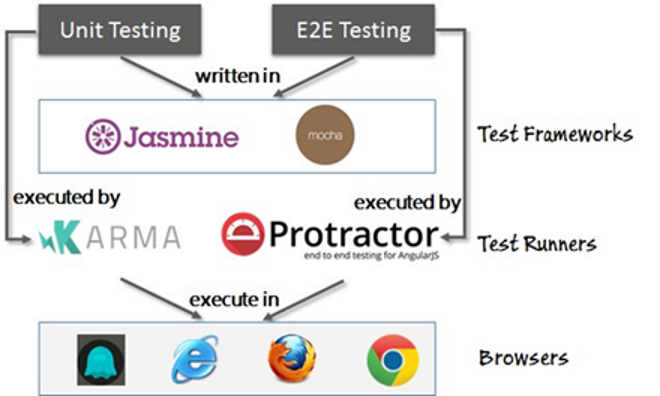
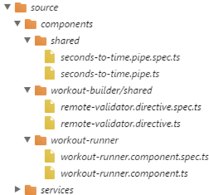
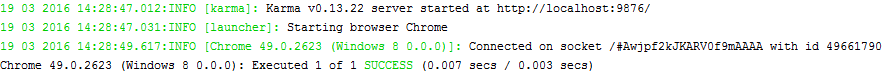
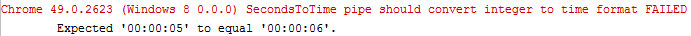
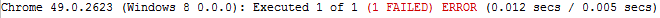
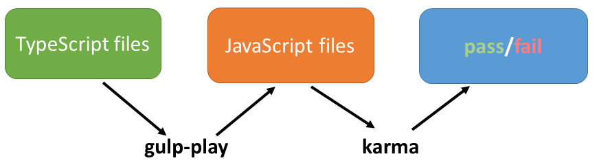

# Session 4 - Unit and End-to-End Testing

Slides for the session can be found at [kevinhennessy.github.io/angular2/Session4](http://kevinhennessy.github.io/angular2/Session4)

The repository for the book chapter is located at [github.com/chandermani/angular2byexample/tree/checkpoint7.1](https://github.com/chandermani/angular2byexample/tree/checkpoint7.1)
## Testing in Angular
### Types of Testing
* Unit Testing
    * Isolated tests - test code only
    * Integrated tests - test code and template
* End-to-end testing
### The Angular testing ecosystem

## Getting started with unit testing
### Setting up Karma for unit testing
* Start by installing Karma from the command line. Navigate to the root of your application
code base (in the trainer folder) and install Karma using this command:
    ```javascript
    npm install karma --save-dev
    ```
* To use Karma from the command line, we need to install its command-line interface:
    ```javascript
    npm install -g karma-cli
    ```
* Next we need to configure Karma
    * Create a tests folder in the root (in the
trainer folder), navigate to it, and start the Karma configuration setup with the following
command:
        ```javascript
        karma init
        ```
    * This starts a command-line wizard that guides us through the options available, including
the test framework, folders to watch, and other such settings. 
    * Once the wizard is complete, it generates a karma.conf.js file. 
    * Instead of using the generated configuration file, copy
the **karma.conf.js** file from the companion code base at checkpoint7.1/tests to your
local tests folder.
        > The karma init wizard installs some packages based on our selection. If
        we skip the wizard, the karma-chromelauncher and karma-jasmine
        packages need to be installed manually for unit testing.
* Finally, we install Jasmine:
    ```javascript
    npm install jasmine-core --save-dev --save-exact
    ```
#### The Karma configuration file
```javascript
module.exports = function(config) {
  config.set({

    // base path that will be used to resolve all patterns (eg. files, exclude)
    basePath: '../',

    // frameworks to use
    // available frameworks: https://npmjs.org/browse/keyword/karma-adapter
    frameworks: ['jasmine'],

   // list of files / patterns to load in the browser
   // files will be loaded in <script> tag
    files: [
      // Polyfills.
      'node_modules/core-js/client/shim.js',
      'node_modules/reflect-metadata/Reflect.js',

      // System.js for module loading
      'node_modules/systemjs/dist/system-polyfills.js',
      'node_modules/systemjs/dist/system.src.js',

      // Zone.js dependencies
      'node_modules/zone.js/dist/zone.js',
      'node_modules/zone.js/dist/proxy.js',
      'node_modules/zone.js/dist/sync-test.js',
      'node_modules/zone.js/dist/jasmine-patch.js',
      'node_modules/zone.js/dist/async-test.js',
      'node_modules/zone.js/dist/fake-async-test.js',

      // The included property determines whether Karma will initially load
      // the file. If set to true, Karma will load these files in a <script> tag. If not, 
      // Karma will not load the file, so some other mechanism must be found to do that. The watched
      // property indicates whether a file will be watched for changes.
      // RxJs.
      { pattern: 'node_modules/rxjs/**/*.js', included: false, watched: false },
      { pattern: 'node_modules/rxjs/**/*.js.map', included: false, watched: false },

      // karma - this is the only file where we have set the included property to true
      {pattern: 'tests/karma-test-shim.js', included: true, watched: true},
      //{pattern: 'src/test/matchers.js', included: true, watched: true},

      // paths loaded via module imports
      // Angular itself
      {pattern: 'node_modules/@angular/**/*.js', included: false, watched: true},
      {pattern: 'node_modules/@angular/**/*.js.map', included: false, watched: true},

      // Angular 2 modal
      {pattern: 'node_modules/angular2-modal/**/*.js', included: false, watched: true},

       // Our built application code
      {pattern: 'dist/**/*.js', included: false, watched: true},

      // paths loaded via Angular's component compiler
      // (these paths need to be rewritten, see proxies section)
      {pattern: 'src/**/*.html', included: false, watched: true},
      {pattern: 'static/**/*.css', included: false, watched: true},

      // paths to support debugging with source maps in dev tools
      {pattern: 'src/**/*.ts', included: false, watched: false},
      {pattern: 'node_modules/**/*.js.map', included: false, watched: false}
    ],

    ...

    // proxied base paths
    proxies: {
      // required for component assests fetched by Angular's compiler
      "/src/": "/base/src/"
    },

    ...

    // enable / disable watching file and executing tests whenever any file changes
    autoWatch: true,

    ...
  })
}

```
#### The Karma test shim file
This file uses SystemJs to transpile and load our code and related modules for testing. We'll not cover that here. You can read a description of that file in the book.

### Organization and naming of our test files
We are using the following conventions in setting up and naming our test files:
* Create one test file for each Typescript file that we plan to test.
* Name each of the test files with the name of the file under test plus **.spec**.
* Place each test file in the directory where the file under test is located.

Our file structure will then look like this:


### Unit testing Angular applications
#### Unit testing pipes
Pipes are the easiest to test as they have minimum or zero dependencies on other
constructs. The SecondsToTimePipe that we created for Workout Runner (the 7 Minute
Workout app) has no dependencies and can be easily unit-tested.
```javascript
import {SecondsToTimePipe} from "./seconds-to-time.pipe";
describe('SecondsToTime pipe', () => {
    let pipe:SecondsToTimePipe;
    beforeEach(() => {
        pipe = new SecondsToTimePipe();
    });
    it('should convert integer to time format', () => {
        expect(pipe.transform(5)).toEqual('00:00:05');
        expect(pipe.transform(65)).toEqual('00:01:05');
        expect(pipe.transform(3610)).toEqual('01:00:10');
    });
});
```
We are using Jasmine syntax here:
* First we wrap the test in a **describe** function that identifies the test. 
* The first parameter of this function is a user-friendly description of the test. 
* For the second parameter, we pass a lambda (fat arrow) function that will contain our test. 
* Within the lambda we call Jasmine's **beforeEach** function and use this to
inject an instance of our pipe.

    >Since the beforeEach function runs before every test that is in our
    **describe** function, we can use it for common code that will run in each of our tests. In this case, it is not strictly necessary since there is only one test.

* Next, we call Jasmine's **it** function and pass it a title, along with three calls to Jasmine's **expect** function (Jasmine's name for assertions). The **expect** function uses **matchers** that do a boolean comparision between the actual and expected value. Examples are:
    ```javascript
    expect(a).toBe(true);
    expect(b).not.toBe(null);
    expect(c).toEqual(12);
    expect(d).toContain("bar");
    expect(e).toBeGreaterThan(f)
    ```
    See [https://jasmine.github.io/2.0/introduction](https://jasmine.github.io/2.0/introduction) for more detail on **expectations** and **matchers**. 
#### Running our test files
Now it's time to run our tests using Karma. 

* First we have to transpile our files from TypeScript to JavaScript. To do this, we start up our application itself in a terminal window by calling:
    ```javascript
    gulp play
    ```
* Next, we run Karma by executing the following command in a
separate terminal window in the trainer folder:
    ```javascript
    karma start tests/karma.conf.js
    ```
* We should then see this output in the terminal window:

    

* The last line shows that our test passed successfully. 

* To make sure that it is reporting the
correct pass/fail results, let's make a change in the test to cause one of the expectations to
fail. 
* Change the time in the first expectation to 6 seconds rather than 5, like so:
    ```javascript
    expect(pipe.transform(5, [])).toEqual('00:00:06');
    ```

* We get the following error message:

    

* We also get a lengthy stack trace below this message and a final line that shows the overall results of our tests:

    
* One thing you'll notice is that when we make the change to our test, we do not have to rerun Karma. Instead, it watches for any changes in our files and related tests and immediately reports success or failure whenever we make a change.

To sum up, we'll be taking the following multi-step approach to executing all our tests.


### Unit testing components
Testing Angular components is more complicated than testing simple pipes or services.
That is because Angular components are associated with views and also usually have more
dependencies than services, filters, or directives.
#### Angular testing utilities
Because of their complexity, Angular has introduced utilities that enable us to test our components more easily. These testing utilities include the **TestBed** class and several helper functions in @angular/core/testing.

**TestBed** has a **createComponent** method that returns a **ComponentFixture** containing several members and methods, including:
* **debugElement**: For debugging a component
* **componentInstance**: For accessing the component properties and methods
* **nativeElement**: For accessing the view's markup and other DOM elements
* **detectChanges**: For triggering the component's change detection cycle

**ComponentFixture** also contains methods for overriding the view, directives, bindings,
and providers of a component.

**TestBed** has a method called **configureTestingModule** that we can use to set up our
testing as its own module. This means we can bypass the initial bootstrap process and
compile our components under test within out test files. 

We can also use **TestBed** to specify
additional dependencies and identify the providers that we will need.

### Start unit testing
#### Debugging unit tests in Karma
### Managing Dependencies in our tests
#### Unit testing WorkoutRunner Component
##### MOCKING DEPENDENCIES - WORKOUT HISTORY TRACKER
Angular allows us to mock our dependencies in a straightforward manner using simple classes. Let's start with mocking WorkoutHistoryTracker. To do that, add the following class just after the imports:

```javascript
class MockWorkoutHistoryTracker {
    startTracking() {}
    endTracking() {}
    exerciseComplete() {}
}
```
##### MOCKING DEPENDENCIES - WORKOUT SERVICE
The workout service makes a remote call to retrieve the data that populates a workout. For unit-testing the workout runner, we will want to replace that call with a mock implementation that returns some static data that we can use to run the test. So we will add a third mock class, as follows:
```javascript
class MockWorkoutService {
    sampleWorkout = new WorkoutPlan(
         "testworkout",
         "Test Workout",
          40,
          [
              new ExercisePlan(new Exercise( "exercise1", "Exercise 1",
              "Exercise 1 description",  "/image1/path",
             "audio1/path"), 50),
              new ExercisePlan(new Exercise( "exercise1", "Exercise 2",
             "Exercise 2 description",  "/image2/path",
             "audio2/path"), 30),
              new ExercisePlan(new Exercise( "exercise1", "Exercise 3",
             "Exercise 3 description",  "/image3/path",
             "audio3/path"), 20)
          ],
          "This is a test workout"
    );
    getWorkout(name: string) {
        return Observable.of(this.sampleWorkout);
    }
    totalWorkoutDuration(){
        return 180;
    };
    export class MockRouter {
    navigate = jasmine.createSpy('navigate');
    }
}
```
##### MOCKING DEPENDENCIES - ROUTER
As with WorkoutHistoryTracker and WorkoutService, we also will be using mocking to handle the dependency that we have on the Angular router. But here we will be taking a slightly different approach. We will assign a jasmine spy to a navigate method on our mock. This will be sufficient for our purposes because we only want to make sure that the router's navigate method is being called with the appropriate route (finished) as a parameter. The jasmine spy will allow us to do that as we will see later.

##### CONFIGURING OUR TEST USING TESTBED
Now that we have our imports and dependencies out of the way, let's get started with the tests themselves. We begin by adding a Jasmine Describe function that will wrap our tests, followed by setting two local variable using let: one for fixture and the other for runner:
```javascript
describe('Workout Runner', () =>{
    let fixture:any;
    let runner:any;
```
Next we'll add a beforeEach function that sets up our test configuration:
```javascript
beforeEach( async(() =>{
    TestBed
        .configureTestingModule({
            declarations: [ WorkoutRunnerComponent, SecondsToTimePipe ],
            providers: [
                {provide: Router, useClass: MockRouter},
                {provide: WorkoutHistoryTracker ,useClass:
                MockWorkoutHistoryTracker},
                {provide: WorkoutService ,useClass: MockWorkoutService}
            ],
            schemas: [ NO_ERRORS_SCHEMA ]
        })
        .compileComponents()
        .then(() => {
            fixture = TestBed.createComponent(WorkoutRunnerComponent);
            runner = fixture.componentInstance;
        });
}));
```
##### async function
We are using an async function in our beforeEach method because this is required when we call the compileComponents method. This method call is asynchronous and we need to use it here because our component has an external template that is specified in a templateUrl. This method compiles that external template and then inlines it so that it can be used by the createComponent method (which is synchronous) to create our component fixture. This component fixture in turn contains a componentInstance-WorkoutRunner. We then assign both the fixture and the componentInstance to local variables.

The async function we are using creates a special async test zone in which our tests will run. You'll notice that this function is simplified from normal async programming and lets us do things such as using the .then operator without returning a promise.

##### Alternative: Second Synchronous beforeEach
```javascript
beforeEach( async(() =>{
    TestBed
        .configureTestingModule({
            declarations: [ WorkoutRunnerComponent, SecondsToTimePipe ],
            providers: [
                {provide: Router, useClass: MockRouter},
                {provide: WorkoutHistoryTracker ,useClass:
                MockWorkoutHistoryTracker},
                {provide: WorkoutService ,useClass: MockWorkoutService}
            ],
            schemas: [ NO_ERRORS_SCHEMA ]
        })
        .compileComponents();
});

beforeEach( () => {
    fixture = TestBed.createComponent(WorkoutRunnerComponent);
    runner = fixture.componentInstance;
});
```
##### Shallow Testing
```javascript
schemas: [ NO_ERRORS_SCHEMA ]
```

This setting allows us to bypass the errors we would otherwise get regarding the custom elements associated with two components that we are using in the component's template: ExerciseDescriptionComponent and VideoPlayerComponent. At this point, we don't want to be testing these components within the test for the WorkoutRunnerComponent. Instead, we should be testing them separately. One thing to be aware of, however, when you use this setting is that it will suppress all schema errors related to elements and attributes in the template of the component under test; so it may hide other errors that you do want to see.

When you set up a test using NO_ERRORS_SCHEMA, you are creating what is called a shallow test, one that does not go deeper than the component you are testing. **Shallow tests allow you to reduce complexities in the templates within the component you are testing and reduce the need for mocking dependencies.**


##### Creating the tests for WorkoutRunnerComponent
To start with, let's add a test case that verifies that the workout starts running once the component is loaded:
```javascript
it('should start the workout', () => {
    expect(runner.workoutTimeRemaining).toEqual(runner.workoutPlan.totalWorkoutDuration());
    expect(runner.workoutPaused).toBeFalsy();
});
``` 
This test asserts that the total duration of the workout is correct and the workout is in the running state (that is, not paused).

Add calls to ngOnInit and ngDoCheck in your test, like so:
```javascript
it('should start the workout', () => {
    runner.ngOnInit();
    runner.ngDoCheck();
    expect(runner.workoutTimeRemaining).toEqual(
            runner.workoutPlan.totalWorkoutDuration());
    expect(runner.workoutPaused).toBeFalsy();
});

 it('should start the first exercise', () => {
    spyOn(runner, 'startExercise').and.callThrough();
    runner.ngOnInit();
    runner.ngDoCheck();
    expect(runner.currentExerciseIndex).toEqual(0);
    expect(runner.startExercise).toHaveBeenCalledWith(
    runner.workoutPlan.exercises[runner.currentExerciseIndex]);
    expect(runner.currentExercise).toEqual(
    runner.workoutPlan.exercises[0]);
});
```
##### USING JASMINE SPIES TO VERIFY METHOD INVOCATIONS
A spy is an object that intercepts every call to the function it is spying on. Once the call is intercepted, it can either return fixed data or pass the call to the actual function being invoked. It also records the call invocation details that can be used later in expect as we did in the preceding test.

There are a couple of things to note here. First, you have to be careful to put the setup for spyOn prior to calling ngOnInit. Otherwise, the spy will not be spying when the startExercise method is called and the method invocation will not be captured.

Second, since the spy is a mock, we will normally not be able to verify anything within the startExercise method. This is because the method itself is being mocked. This means that we cannot actually verify that the currentExercise property has been set, since that is being done inside the mocked method. However, Jasmine allows us to chain the spy with .and.callThrough, which will mean that in addition to tracking the calls to the method, it will delegate to the actual implementation. This then allows us to test that the currentExercise has also been set correctly inside the startExercise method.

##### USING JASMINE SPIES TO VERIFY DEPENDENCIES
While we just used a spy to verify the call to a method within our class, Jasmine spies are also useful in mocking calls to external dependencies. But why test calls to our external dependencies at all? After all, we are trying to limit our testing to the component itself!
 
So let's create a spy and confirm that WorkoutHistoryTracker started when the workout started.

Add this it block after the preceding one:
```javascript
it("should start history tracking", inject([WorkoutHistoryTracker], (tracker: WorkoutHistoryTracker) => {
     spyOn(tracker, 'startTracking');
     runner.ngOnInit();
     runner.ngDoCheck();
     expect(tracker.startTracking).toHaveBeenCalled();
 }));
```
##### TESTING EVENT EMITTERS
Examining the code for the WorkoutRunner, we see that it sets up several event emitters that look like the following one for workoutStarted:
```javascript
@Output() workoutStarted: EventEmitter<WorkoutPlan> = new EventEmitter<WorkoutPlan>();
```
It's actually pretty easy to do. If we remember that an event emitter is an Observable Subject to which we can subscribe, we realize that we can simply subscribe to it in our unit test. Let's revisit our test that verifies that a workout is starting and add the highlighted code to it:
```javascript
it('should start the workout', () => {
    runner.workoutStarted.subscribe((w: any) => {
      expect(w).toEqual(runner.workoutPlan);
    });
    runner.ngOnInit();
    runner.ngDoCheck();
    expect(runner.workoutTimeRemaining).toEqual(
    runner.workoutPlan.totalWorkoutDuration());
    expect(runner.workoutPaused).toBeFalsy();
});
```
##### fakeAsync()
The fakeAsync function allows us to run otherwise asynchronous code synchronously. It does this by wrapping the function to be executed in a fakeAsync zone. It then supports using synchronous timers within that zone and also allows us to simulate the asynchronous passage of time with tick().

This makes testing asynchronous functions much easier.  This used to be handled with Jasmine's done function and chaining / handling all the promises.  In some cases you will still need to use the done approach:   

##### TESTING INTERVAL AND TIMEOUT IMPLEMENTATIONS
One of the interesting challenges for us is to verify that the workout progresses as time elapses. The Workout component uses setInterval to move things forward with time. How can we simulate time without actually waiting?

The answer is the Angular testing library's fakeAsync function, which 

Let's see how we can use the fakeAsync function to test the timeout and interval implementations in our code. Add the following test to workout-runner.spec.ts:
```javascript
it('should increase current exercise duration with time', fakeAsync(() => {
    runner.ngOnInit();
    runner.ngDoCheck();
    expect(runner.exerciseRunningDuration).toBe(0);
    tick(1000);
    expect(runner.exerciseRunningDuration).toBe(1);
    tick(1000);
    expect(runner.exerciseRunningDuration).toBe(2);
    TestHelper.advanceWorkout(7);
    expect(runner.exerciseRunningDuration).toBe(10);
    runner.ngOnDestroy();
}));
```
 
### Unit Testing Services
##### MOCKING HTTP REQUEST/RESPONSE WITH MOCKBACKEND
When testing services (or, as a matter of fact, any other Angular construct) that make remote requests, we obviously do not want to make actual requests to a backend to check the behavior.

Create a new file named workout-service.spec.ts and add the following import statements at the top of the file:
```javascript
import {addProviders, fakeAsync, inject, tick} from '@angular/core/testing';
import {BaseRequestOptions, Http, Response, ResponseOptions} from '@angular/http';
import {MockBackend, MockConnection} from '@angular/http/testing';
import {WorkoutService} from './workout-service';
import {WorkoutPlan} from "./model";
```
In addition to the imports from the testing module, we are importing both the http module and the MockBackend and MockConnection from the http/testing module.

Once we have the imports in place, we will begin creating the test with the Jasmine describe statement that wraps our tests, and will set several local variables:
```javascript
describe('Workout Service', () => {
    let collectionUrl:string = "...[mongo connnection url]...";
    let apiKey:string = "...[mongo key]...";
    let params:string = '?apiKey=' + apiKey;
    let workoutService:WorkoutService;
    let mockBackend:MockBackend;
```
The next step is set up the providers and dependency injection for our tests. To handle the providers, add the following to the test file:
```javascript
beforeEach(() => {
    addProviders([
        MockBackend,
        BaseRequestOptions,
        {
            provide: Http,
            useFactory: (backend:MockBackend,
            options:BaseRequestOptions) => {
                return new Http(backend, options);
            },
            deps: [MockBackend, BaseRequestOptions]
        },
        WorkoutService
    ])
});
```
Not surprisingly, we are adding MockBackEnd and WorkoutService as providers. At the same time, we are also adding BaseRequestOptions from the http module. And then we are adding a provider for HTTP that uses a factory with the MockEnd and BaseRequestOptions. This factory will then return an Http service that is using the MockBackend. So now we can make an HTTP call from our tests that will not be a remote call, but instead will use the MockBackEnd to fake that call.

To complete the setup for our tests, we add the following to inject dependencies into each of our tests:
```javascript
beforeEach(inject([WorkoutService, MockBackend], (service:WorkoutService, backend:MockBackend) => {
    workoutService = service;
    mockBackend = backend
}));
```
We will make sure that it returns all workouts when the get Workouts method is called. To do that, add the following test:
```javascript
it("should return all workout plans", fakeAsync(() => {
    let result:any;
    mockBackend.connections.subscribe((connection:MockConnection) => {
      expect(connection.request.url).toBe(collectionUrl + "/workouts" +
      params);
      let response = new ResponseOptions({body: '[{ "name": "Workout1",
      "title": "workout1" }, { "name": "Workout1", "title": "workout1"
      }]'});
        connection.mockRespond(new Response(response));
    });
    workoutService.getWorkouts().subscribe((response:Response) => {
        result = response;
    });
    expect(result.length).toBe(2);
    expect(result[0] instanceof WorkoutPlan).toBe(true);
}));
```
### Unit Testing Directives
No other Angular constructs that we have tested so far do not involve any UI interaction. But directives, as we know, are a different beast. Directives are all about enhancing a component's view and extending the behavior of HTML elements. While testing directives, we cannot ignore the UI connections, and hence directive testing may not strictly qualify as unit testing.

The good thing about directive testing is that its setup process is not as elaborate as that for services or components. The pattern to follow while unit-testing directives is as follows:

1. Take an HTML fragment containing the directive markup.
2. Compile and link it to a mock component.
3. Verify that the generated HTML has the required attributes.
4. Verify the changes if the directive created changes the state.

Similar to our other test files, we add a remote-validator.directive.spec.ts file in the workout builder folder.

Just below the import statements, add the following component definition:
```javascript
@Component({ 
  template: ` 
  <form> 
  <input type="text" name="workoutName" id="workout-name" 
  [(ngModel)]="workoutName" a2beBusyIndicator 
  a2beRemoteValidator="workoutname" 
  [validateFunction]="validateWorkoutName"> 
  </form> 
  ` 
}) 
export class TestComponent { 
    workoutName: string; 
 
    constructor() { 
        this.workoutName = '7MinWorkout'; 
    } 
    validateWorkoutName = (name: string): Promise<boolean> => { 
        return Promise.resolve(false); 
    } 
} 
```
Next, we set up the describe statement for our test suite by adding the following code, which injects  RemoteValidatorDirective into our tests:
```javascript
describe('RemoteValidator', () => { 
    let fixture: any; 
    let comp: any; 
    let debug: any; 
    let input: any; 
 
    beforeEach(async(() => { 
        TestBed.configureTestingModule({ 
            imports: [ FormsModule ], 
            declarations: [ TestComponent, RemoteValidatorDirective ] 
        }); 
        fixture = TestBed.createComponent(TestComponent); 
        comp = fixture.componentInstance; 
        debug = fixture.debugElement; 
        input = debug.query(By.css('[name=workoutName]')); 
    }));  
```

Now we are ready to write our individual tests. First, we'll write a test to confirm that we have been able to load  RemoteValidatorDirective. So add the following code:
```javascript
it("should load the directive without error", fakeAsync(() => {
    expect(input.attributes.a2beRemoteValidator).toBe('workoutname',  'remote validator directive should be loaded.')
}));
```
What's interesting about this test is that using the debugElement, we have been able to drill-down into the attributes of the input tag in our host component and find our validator, confirming that it has indeed been loaded. 

The first test will make sure that an error is created if remote validation fails (that is, a workout with the same name as the one we are using is found). Add the following code for that test:
```javascript
it('should create error if remote validation fails', fakeAsync(() => {
    spyOn(comp, 'validateWorkoutName').and.callThrough();
    fixture.detectChanges();
    input.nativeElement.value = '6MinWorkout';
    tick();
    let form: NgForm = debug.children[0].injector.get(NgForm);
    let control = form.control.get('workoutName');
    expect(comp.validateWorkoutName).toHaveBeenCalled();
    expect(control.hasError('workoutname')).toBe(true);
    expect(control.valid).toBe(false);
    expect(form.valid).toEqual(false);
    expect(form.control.valid).toEqual(false);
    expect(form.control.hasError('workoutname', 
    ['workoutName'])).toEqual(true);
}));
```
The next test is the mirror opposite of this test and checks for a positive:
```javascript
it('should not create error if remote validation succeeds', fakeAsync(() => {
    spyOn(comp,' validateWorkoutName').and.returnValue(
    Promise.resolve(true));
    fixture.detectChanges();
    input.nativeElement.value = '6MinWorkout';
    tick();
    let form: NgForm = debug.children[0].injector.get(NgForm);
    let control = form.control.get('workoutName');
    expect(comp.validateWorkoutName).toHaveBeenCalled();
    expect(control.hasError('workoutname')).toBe(false);
    expect(control.valid).toBe(true);
    expect(form.control.valid).toEqual(true);
    expect(form.valid).toEqual(true);
    expect(form.control.hasError('workoutname',    ['workoutName'])).toEqual(false);
}));
```

## Getting started with E2E testing

### What is e2e testing?

*  Testing the application like a real user.

We will be looking at how to run e2e testing of the Personal Trainer app using angular-cli

## 1. Introducton to angular-cli  

* Command line interface for creating angular applications.
* Scafolding - uses best practices to create templates.
* Testing framework is configured by default - both unit testing and e2e testing.

```bash
npm install -g @angular/cli

ng new trainer-e2e

cd trinug

ng serve

```

>  runs the app in the default port 4200 

## cli scaffolds the following files and runs npm install.


### List of Commands that cli currently supports.


Scaffold  | Usage
---       | ---
[Component](https://github.com/angular/angular-cli/wiki/generate-component) | `ng g component my-new-component`
[Directive](https://github.com/angular/angular-cli/wiki/generate-directive) | `ng g directive my-new-directive`
[Pipe](https://github.com/angular/angular-cli/wiki/generate-pipe)           | `ng g pipe my-new-pipe`
[Service](https://github.com/angular/angular-cli/wiki/generate-service)     | `ng g service my-new-service`
[Class](https://github.com/angular/angular-cli/wiki/generate-class)         | `ng g class my-new-class`
[Guard](https://github.com/angular/angular-cli/wiki/generate-guard)         | `ng g guard my-new-guard`
[Interface](https://github.com/angular/angular-cli/wiki/generate-interface) | `ng g interface my-new-interface`
[Enum](https://github.com/angular/angular-cli/wiki/generate-enum)           | `ng g enum my-new-enum`
[Module](https://github.com/angular/angular-cli/wiki/generate-module)       | `ng g module my-module`


You can use the `ng generate` (or just `ng g`) command to generate Angular components:

```bash
ng generate component my-new-component
ng g component my-new-component # using the alias
```

>  angular-cli will add reference to the new generated component in the app.module.ts

## 2. How to Run e2e Test

### Run `ng e2e` 

The test runner will look for files which ends with **\*.spec.ts** in **e2e** folder 


## Frameworks used for e2e testing

1. Protractor - uses Webdriver to control browsers and simulate user actions.
2. Jasmine 


### 


## What happens when you run `ng e2e`


## Protractor config file - protractor.conf.js


## Two files for each page.

	1. File which have the  actual tests -  ends with spec.ts
	2. File which encapsulates the test cases - ends with .po.ts - called as page objects.
		* getTitle() - Gets the title of the page.
		* getExcerciseCount() - counts the number of exercises.
		
The spec file will use the page objects and call the appropriate functions.
		

## Page objects  -  files ending with .po.ts

  *  Encapsulate the test cases for each page.

## Locators

### Locators is the main feature which tells protractor to
    * Find dom elements
	* Interact with elements like adding texts and clicking buttons.

```js
// Find an element using a css selector.
by.css('.myclass') 

// Find an element with the given id.
by.id('myid')

// Find an element with a certain ng-model.
// Note that at the moment, this is only supported for AngularJS apps.
by.model('name')

// Find an element bound to the given variable.
// Note that at the moment, this is only supported for AngularJS apps.
by.binding('bindingname')
```
To Learn more about locators, [checkout the githib link](https://github.com/angular/protractor/blob/master/docs/locators.md)

> http://www.protractortest.org/#/api